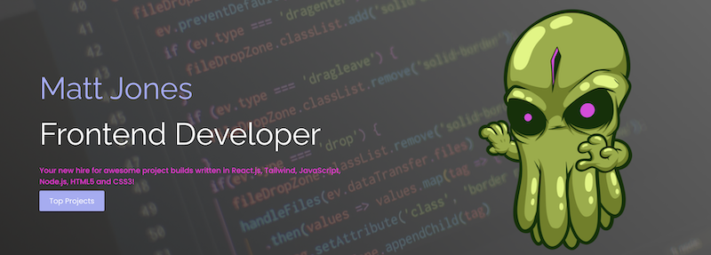
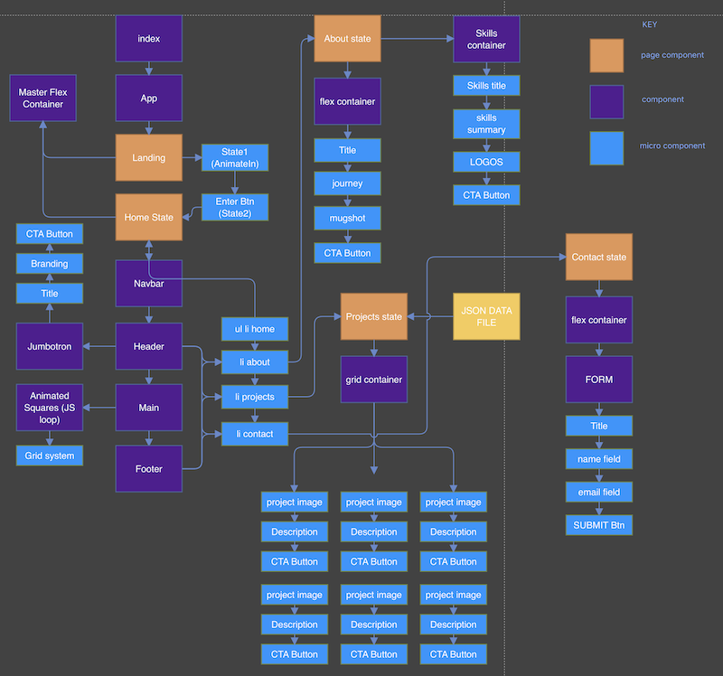
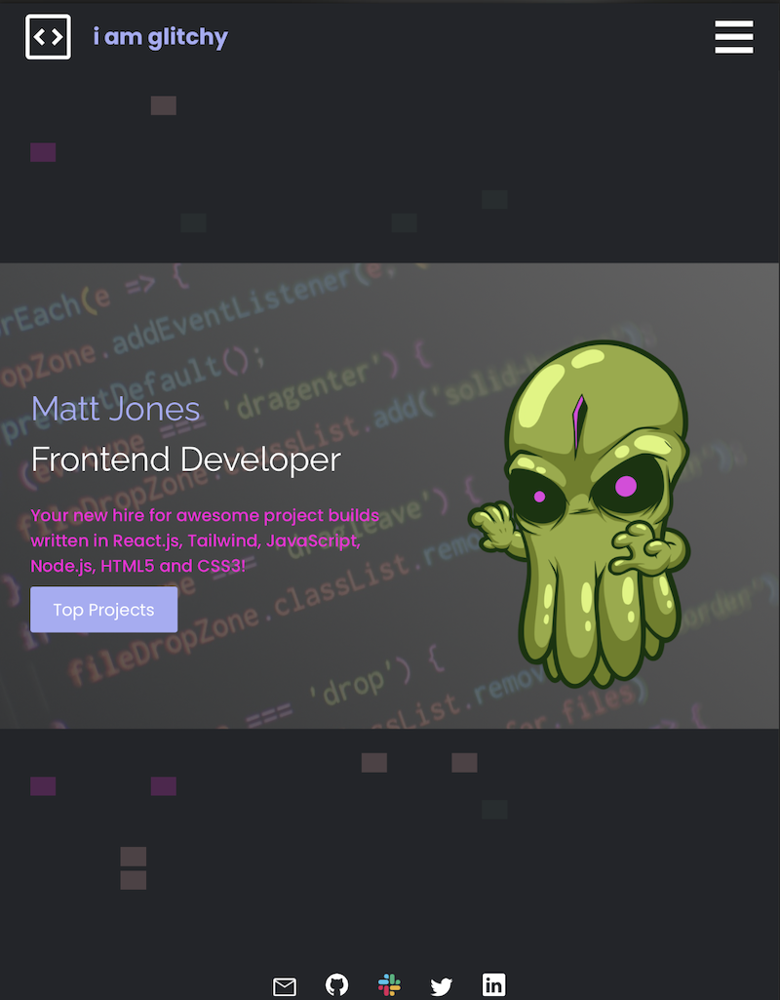
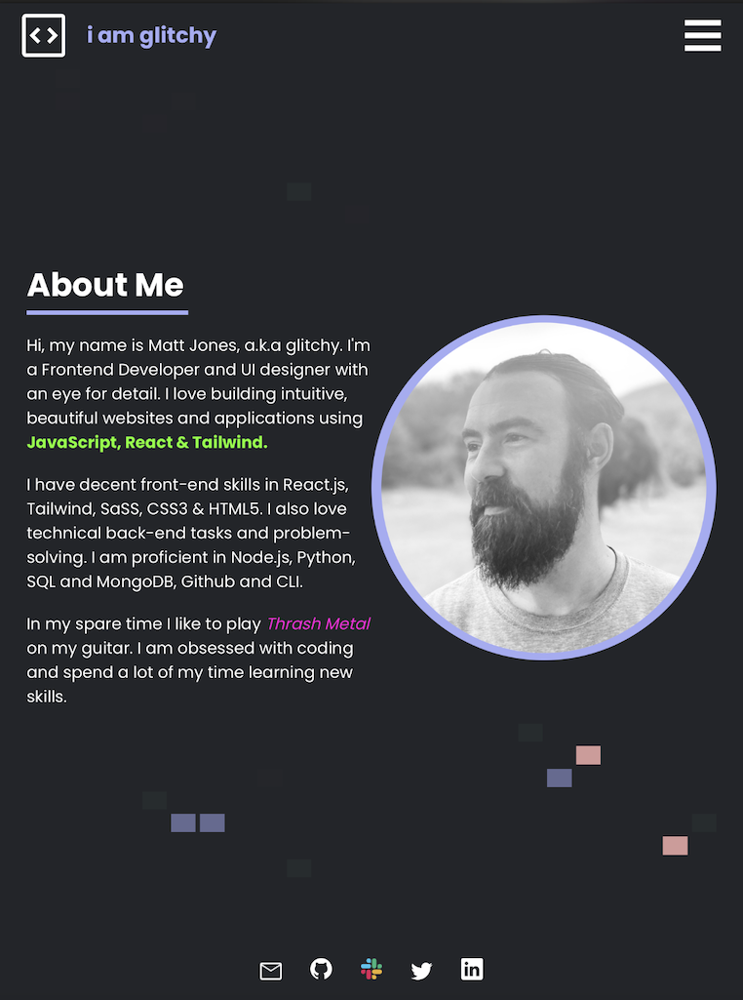
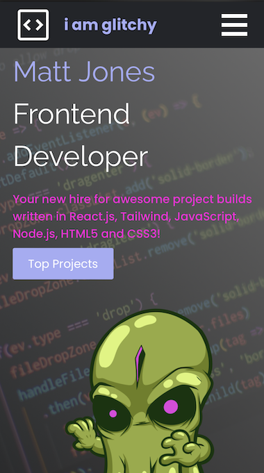
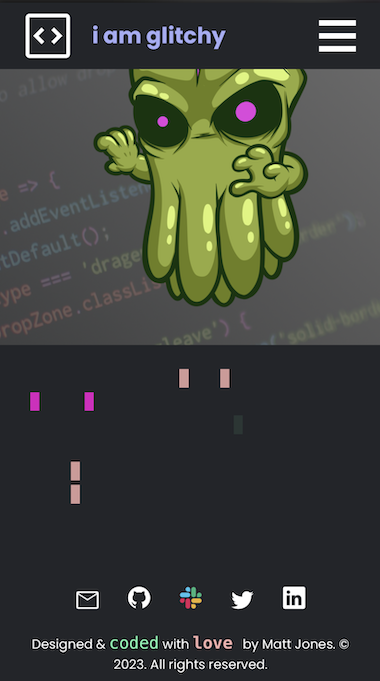

<!-- Readme top-->
<a name="readme-top"></a>

<!-- Project shields -->
<span style="display:block" align="center" class="shields">

[![Stargazers][stars-shield]][stars-url]
[![Issues][issues-shield]][issues-url]
[![License][license-shield]][license-url]
[![LinkedIn][linkedin-shield]][linkedin-url]

</span>

<!-- Readme Header -->
<div align="center">
	
</div>
<br>

<!-- project title -->
#
<div align="center">
  <h2>Next Level React & Tailwind Portfolio 2023</h2>
  <h3>"i am glitchy edition"</h3>
</div>

<div align="center">
<p>My latest portfolio built using React.js, Node.js, JavaScript, Tailwind, CSS and HTML5.</p>

<a href="https://github.com/Matt-Jones-Developer/i_am_glitchy_react_tailwind_portfolio/"><strong>Explore the docs »</strong></a>
<br />
<br />
<a href="https://github.com/Matt-Jones-Developer/i_am_glitchy_react_tailwind_portfolio/">View Project</a>
·
<a href="https://github.com/Matt-Jones-Developer/i_am_glitchy_react_tailwind_portfolio/issues">Report Bug</a>
·
<a href="https://github.com/Matt-Jones-Developer/i_am_glitchy_react_tailwind_portfolio/issues">Request Feature</a>
·
<a href="https://github.com/matt-jones-developer?tab=repositories">Check out my work</a>
·
</div>
<br>

#

## Table of Contents

* [About The Project](#about)
* [User Story](#userstory)
* [Built With](#builtwith)
* [Installation](#installation)
* [Usage](#usage)
* [Tests](#tests)
* [Contributing](#contributing)
* [License](#license)
* [Questions](#questions)
* [Acknowledgements](#acknowledgements)
#

<!-- about the project -->
## Project Summary

Welcome to the latest, revamped edition of my portfolio; the "i am glitchy" edition. A remixed version of my bootstrap portfolio this time built with React.js and Tailwind!  

<!-- video of finished product -->
<div align="center">
  
</div>

#
### Motivation

I wanted to improve on my portfolio build from 3 months ago, taking the new skills I've learnt, improve the look and feel of the site and keep it up to date with my latest projects.  

#
### Challenges

I actually found the React learning curve a struggle, initially.  I had issues with stylesheets especially, where styles weren't being applied and found the component idea a little confusing.  Image importing was frustrating too.

Understanding your apps component flow, working on each small section at a time until it works (components need to play well together too or React will just break!) and playing around with react some more generally, really helped improve my confidence and ability so I now feel that I could build anything with it!  I could not imagine building a website in vanilla HTML/CSS ever again.

I really disliked using Bootstrap with React too and found that once again components were failing, styles were conflicting and by the weekend I was getting concerned.  

I decided to learn Tailwind over the weekend and found the two worked in harmony together.  
Very easy, memorable syntax, fantastic documentation and examples, coupled with finally getting my head around react imports and react file structure allowed me to produce a portfolio to a high standard in the end.  

The project taught me a lot and I have spent around 5 days simply learning React and Tailwind to accomplish this.

Here is the component flow design I made to help me piece the app together correctly:

<div align="center">
  
</div>

#
### Unique Selling Points

My builds USP’s are that the website is attractive and well polished, fully responsive and has a great colour palette.  
I feel it speaks of who I am. 

I really enjoyed taking the 'coloured squares' html from my original portfolio, and using vanilla JavaScript was able to dynamically generate them instead and randomly select colours too which I felt really proud that it shows how far I've come with my learning - my original html has like 200 empty ```<divs>``` in and was very amateurish!

For the floating Hero Image I tapped into Tailwind CSS animations and learned how to import and use my CSS animations within the tailwind.config file.  Really powerful and way better than regular CSS.

The portfolio highlights about me, shows off my best projects and uses a data.json file that holds all the info about each project.  The contact page is great too and my CV can be viewed in a new tab, or download via a link.

#

<p align="right">(<a href="#readme-top">back to top</a>)</p>


## Installation

The build is deployed and ready to view it, head to: 
[ "i am glitchy" - react portfolio](https://matt-jones-developer.github.io/i_am_glitchy_react_tailwind_portfolio/) 

### Installation Instructions

If you want to get started using React simply create new project folder, open it in the terminal and type:

```
npm install
```
Install React-App:
```
npx create-react-app <project-name>
```
Install additional requirements:
```
npm i react-router-dom
npm i bootstrap (or)
npm i react-bootstrap
```
For Tailwind:
```
npm i tailwindcss
```
To run your app and start creating:
```
npm run start
```
Finally, for deploying to Github Pages:
(See my walkthrough below on how to build, test and deploy)
```
gh-pages
```

## Usage

Navigate the site using the navbar.  If on mobile you can use the hamburger icon and select an item from the slide out menu.

View details about me, my projects and contact me via the form or social media links.

View the CLI program screenshots below:

<div align="center">
  
</div>
<div align="center">
  
</div>
<div align="center">
  
</div>

Screenshots of the apps output with
fully responsive design:

<!-- centered images -->
<div align="center">
<!-- ![mobile-screenshot1] ![mobile-screenshot2] -->
  
  
</div>


<p align="right">(<a href="#readme-top">back to top</a>)</p>

## Tests

Jest was used for all testing.  You can test the app using:
```
npm run test 
```


## Contributing

N/A

<p align="right">(<a href="#readme-top">back to top</a>)</p>


#
## License

This project is licensed under the terms of the General Public License (GNU 3.0)

For more information, please visit this link: [GNU AGPL v3.0](https://choosealicense.com/licenses/agpl-3.0/)


#
## Questions

For questions or concerns, please contact [matt-jones-developer](https://github.com/Matt-Jones-Developer/i_am_glitchy_react_tailwind_portfolio) via Github.

###  Other contacts:

You can also reach me via the following: 👻💬

📪 [Email](glitchyghost81@gmail.com) · 💻 [LinkedIn](https://www.linkedin.com/in/matt-jones-zx81) · 👾 [Twitter](glitchy81) · 👻 [Slack](mattjones) · 🤡 [Instagram](glitchy) 

<p align="right">(<a href="#readme-top">back to top</a>)</p>

#

## Deployment & Repo links:

Project Repo Link: [https://github.com/Matt-Jones-Developer/i_am_glitchy_react_tailwind_portfolio](https://github.com/Matt-Jones-Developer/i_am_glitchy_react_tailwind_portfolio)

Deployed Project Link: [https://matt-jones-developer.github.io/i_am_glitchy_react_tailwind_portfolio/]

# 
## Acknowledgments

Artists have been accredited within my code, the main 'ghost kraken' hero image was created by Junior Betta.  
View their work here: [Junior Betta](https://pngtree.com/junior-betta_49180563?type=1)

Thanks also to Aldo for their ghost icon: [Aldo Icons](https://www.flaticon.com/authors/aldo-cervantes)

#
<br>
<h3>How was this readme created?!
<h3 align="left">Built with <a href="https://github.com/Matt-Jones-Developer/speedme_that_readme_generator/">SPEEDME</a>: The ultimate README generator!</h3>


[stars-shield]: https://img.shields.io/github/stars/matt-jones-developer/i_am_glitchy_react_tailwind_portfolio.svg?style=for-the-badge
[stars-url]: https://github.com/Matt-Jones-Developer/i_am_glitchy_react_tailwind_portfolio/stargazer
[issues-shield]: https://img.shields.io/github/issues/matt-jones-developer/i_am_glitchy_react_tailwind_portfolio.svg?style=for-the-badge
[issues-url]: https://github.com/Matt-Jones-Developer/i_am_glitchy_react_tailwind_portfolio/issues
[license-shield]: https://img.shields.io/github/license/matt-jones-developer/i_am_glitchy_react_tailwind_portfolio.svg?style=for-the-badge
[license-url]: https://github.com/Matt-Jones-Developer/i_am_glitchy_react_tailwind_portfolio/blob/main/LICENSE
[linkedin-shield]: https://img.shields.io/badge/-LinkedIn-black.svg?style=for-the-badge&logo=linkedin&colorB=555
[linkedin-url]: https://www.linkedin.com/in/matt-jones-zx81

[product-screenshot]: ./src/assets/screenshots/app_screenshot.png
[product-screenshot-2]: ./src/assets/screenshots/app_screenshot_2.png
[product-screenshot-3]: ./src/assets/screenshots/app_screenshot_3.png

[console-output-screenshot]: ./src/assets/screenshots/component_flow.png
[tablet-screenshot1]: ./src/assets/screenshots/tablet_screenshot.png
[tablet-screenshot2]: ./src/assets/screenshots/tablet_screenshot_2.png
[mobile-screenshot1]: ./src/assets/screenshots/mobile_screenshot_1.png
[mobile-screenshot2]: ./src/assets/screenshots/mobile_screenshot_2.png


#


## This Portfolio Was Built In React.js

This project was bootstrapped with [Create React App](https://github.com/facebook/create-react-app).

